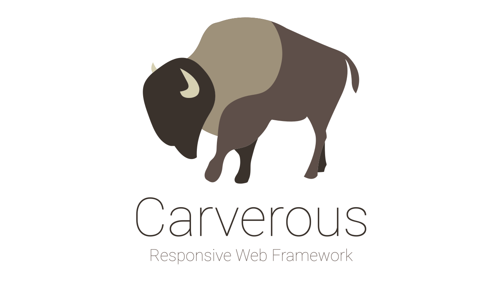

## Overview
A responsive front-end framework I started off from scratch for my web portfolio.
Some useful implementations are added along the way.
It is developed having a mobile first approach in mind,
meaning the code is designed to prioritise mobile devices first
and then adjust the components as the screen scales up.
It doesn't require any third-party JS library such as jQuery.

[](https://github.com/cefjoeii/carverous/blob/master/LICENSE) 

## Browser Support

| [](http://godban.github.io/browsers-support-badges/)</br>IE / Edge | [](http://godban.github.io/browsers-support-badges/)</br>Firefox | [](http://godban.github.io/browsers-support-badges/)</br>Chrome |
| --------- | --------- | --------- |
| IE10, IE11, Edge| last 2 versions| last 2 versions

## Contribute
Make sure that Git, NodeJS, and npm are installed. In the terminal:
```
git clone https://github.com/cefjoeii/carverous.git
npm install
```
Run the default task from the gulpfile.js . Simply run in the terminal:
```
gulp
```
Make sure your commit messages are in present tense.
<br>
Example:
<br>
`git commit -m "Update buttons"`
<br>
Instead of:
<br>
`git commit -m "Updated buttons"`


## Credits
* Manually forked and merged
[Normalize.css](https://github.com/necolas/normalize.css) &
[Reboot](https://github.com/twbs/bootstrap) (Bootstrap).<br>
* Borrowed some handy class names from Bootstrap.<br>
* Re-implemented [Hamburgers](https://github.com/jonsuh/hamburgers) to avoid code repetition & modified the values to blend with our nav.
* You can freely use [FontAwesome](http://fontawesome.io/) or any other font icons out there.

* Books
  * [You Don't Know JS series](https://www.goodreads.com/series/139311-you-don-t-know-js)
  * [Learning JavaScript: Add Sparkle and Life to Your Web Pages](http://www.goodreads.com/book/show/27806241-learning-javascript)

<!---
The scripts are written in ES6 and are transpiled using Babel.
--->
