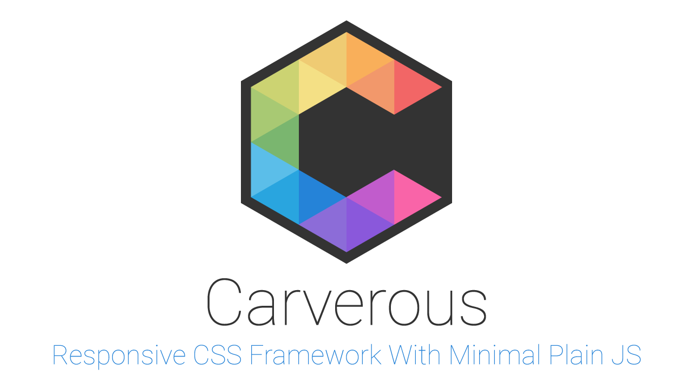

## Overview
A responsive front-end framework that was started off from scratch for simple web layout projects. It doesn't require any third-party JS library such as jQuery. It is developed having a mobile first approach in mind, meaning the code is designed to prioritize mobile devices first and then adjust the components as the screen scales up.

[](https://github.com/carverous/carverous/blob/master/LICENSE)  

## Show Some :heart: :wave:
[](https://github.com/carverous/carverous)
[](https://github.com/carverous/carverous/fork)
[](https://github.com/carverous/carverous)

[](https://github.com/cefjoeii)
[](https://facebook.com/cefjoeii)
[](https://instagram.com/cefjoeii)
[](https://twitter.com/cefjoeii)

## Browsers Support
| [](http://godban.github.io/browsers-support-badges/)</br>IE / Edge | [](http://godban.github.io/browsers-support-badges/)</br>Firefox | [](http://godban.github.io/browsers-support-badges/)</br>Chrome | [](http://godban.github.io/browsers-support-badges/)</br>Opera |
| --------- | --------- | --------- | --------- |
| IE10, IE11, Edge| last 2 versions| last 2 versions| last 2 versions

## Usage
Download or clone. Inside the *dist* folder, you will find the compiled and minified files. You will see a directory structure like this:

```
dist/
├── css/
│   ├── carverous.css
│   ├── carverous.min.css
│   ├── carverous-grid.css
│   ├── carverous-grid.min.css
│   └── ...
├── fonts/
│   └── ...
└── js/
    ├── carverous.js
    └── carverous.min.js
```
Simply link the css & js files you need in your html code. For example:
<br>
Inside the head tag, put `<link rel="stylesheet" href="css/carverous.min.css">`
<br>
Above the closing body tag, put `<script src="js/carverous.min.js"></script>`

## Contributing
Make sure that Git, Node.js, and npm are installed. Fork the repository.

Then in the terminal:
```
git clone <your-forked-repo-url>
cd carverous
npm install
npm install gulp-cli -g
```
Run the default task from the gulpfile.js . Simply run in the terminal:
```
gulp
```

All the Sass/SCSS & JavaScript code are located inside the *src* folder. Feel free to help out. American English is used all across the entire project for consistency. Make sure your commit messages are in present tense.

This: `git commit -m "Fix bugs and update button colors."`
<br>
Not this: `git commit -m "Fixed bugs and updated button colours."`
<br>

Push your changes and make a pull request. I will verify and do the code minification and versioning.

## To Do
- [ ] Documentation

## Credits
* Manually forked and merged
[Normalize.css](https://github.com/necolas/normalize.css) &
[Reboot](https://github.com/twbs/bootstrap) (Bootstrap).<br>
* Borrowed some handy class names from Bootstrap.<br>
* Re-implemented these awesome [Hamburgers](https://github.com/jonsuh/hamburgers) to avoid code repetition & modified the values to blend with our nav.
* You can freely use [FontAwesome](http://fontawesome.io/) or any other font icons out there.

* Books
  * [You Don't Know JS series](https://www.goodreads.com/series/139311-you-don-t-know-js)
  * [Learning JavaScript: Add Sparkle and Life to Your Web Pages](http://www.goodreads.com/book/show/27806241-learning-javascript)

<!---
The scripts are written in ES6+ and are transpiled using Babel.
--->
